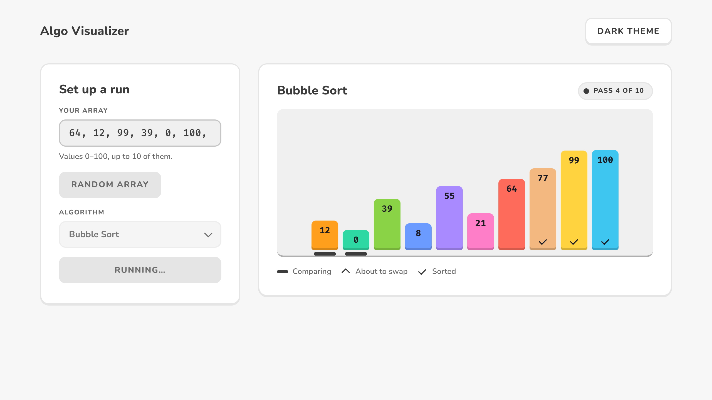
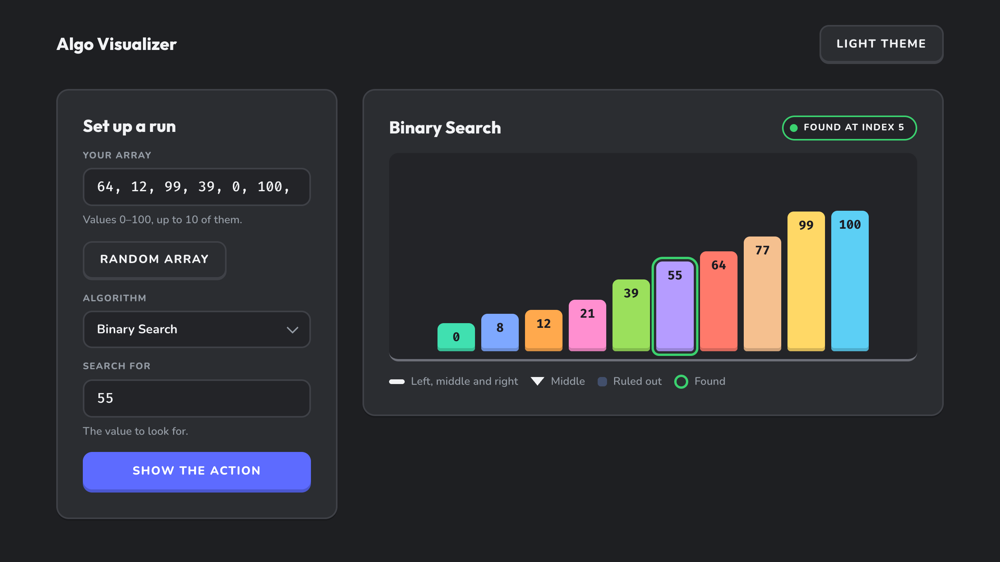

# Algo Visualizer

Watch an algorithm think. Type an array, pick an algorithm, and see every comparison, swap and search step play out on colourful tiles.

**Live:** https://algoviz.smtamim.dev

| Light | Dark |
|---|---|
|  |  |

## Algorithms

| Algorithm | What you see |
|---|---|
| Linear Search | A pointer walks the array left to right until it finds the value. |
| Binary Search | The array is sorted first, then the left, middle and right pointers close in. Tiles that are ruled out fade. |
| Bubble Sort | Neighbouring tiles are compared and lifted before they swap. Each pass settles one tile into place. |
| Selection Sort | An arrow tracks the smallest value found so far, which is swapped into place at the end of each step. |

Each value keeps its tile colour through every swap, so you can follow one value (say, "the pink 64") through the whole sort.

## Using it

1. Enter up to 10 whole numbers from 0 to 100, separated by commas. You can also press **Random array**.
2. Choose an algorithm. Linear and Binary Search also ask for the value to find.
3. Press **Show the action**.

The status pill reports progress, for example "Pass 2 of 10" or "Found at index 5". The legend under the stage explains the marks the selected algorithm uses. Use the button in the top-right corner to switch between the light and dark themes; your choice is remembered. If your system has "reduce motion" turned on, runs skip the animation delays.

## Run it locally

It's a static site with no build step. The scripts are ES modules, so serve the folder over HTTP rather than opening `index.html` directly:

```sh
git clone https://github.com/SMTamim/algo-visualizer.git
cd algo-visualizer
python3 -m http.server 5500
```

Then open http://localhost:5500. Any static file server works.

## Project structure

```
index.html              Markup: header, set-up panel, stage, footer
style.css               App layout only (all colours come from design tokens)
design-system/
  tokens.css            Colour, type, spacing and radius tokens for light and dark
  components.css        av-* component classes (buttons, fields, tiles, pointers, stage)
  algoviz.js            window.AlgoViz: renders tiles and drives pointers, states and swaps
assets/scripts/
  script.js             Input parsing, validation, theme toggle, running an algorithm
  common.js             Visual helpers shared by the algorithms
  linear_search.js, binary_search.js, bubble_sort.js, selection_sort.js
```

Want to add an algorithm? [CONTRIBUTING.md](CONTRIBUTING.md) walks through it step by step, with a working Insertion Sort example.

## Deployment

Cloudflare Pages deploys `main` to https://algoviz.smtamim.dev on every push, with no build command. Branches pushed to this repo get preview deployments.

## Author

S M Tamim Mahmud · [GitHub](https://github.com/SMTamim) · [LinkedIn](https://www.linkedin.com/in/sm-tamim-mahmud/) · [Portfolio](https://smtamim.dev)

## License

[MIT](LICENSE)
